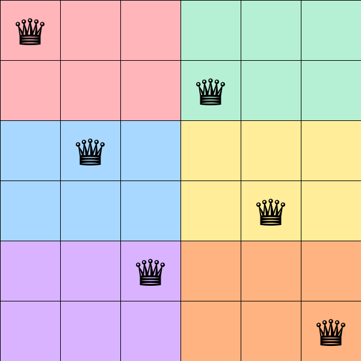

# Tucil 1 IF2211 - Queens LinkedIn Solver

## Deskripsi

Program ini merupakan solver untuk puzzle Queens dari LinkedIn yang diimplementasikan menggunakan algoritma **brute force**. Program mencoba seluruh kemungkinan penempatan queen pada papan NxN dengan meng-generate semua permutasi posisi kolom, lalu memvalidasi setiap permutasi terhadap tiga constraint:

1. Setiap queen harus berada di region warna yang berbeda.
2. Tidak ada dua queen yang bertetangga (termasuk diagonal).
3. Tidak ada dua queen pada baris atau kolom yang sama.

Program dilengkapi GUI yang menampilkan visualisasi papan secara real-time selama pencarian solusi, serta fitur penyimpanan hasil dalam format `.txt` dan `.png`.

## Struktur Program

```
Tucil-1-Stima/
├── bin/                  # Executable (.exe)
├── doc/                  # Laporan
├── src/
│   ├── main.py           # Source code utama
│   ├── input1.txt        # Test case 1
│   ├── input2.txt        # Test case 2
│   ├── ...
│   └── input8.txt        # Test case 8
├── test/                 # Output solusi (txt & png)
├── requirements.txt
├── .gitignore
└── README.md
```

## Requirement

- Python 3.10 atau lebih baru
- Library:
  - `customtkinter`
  - `Pillow`
  - `pyinstaller==6.3.0`

## Instalasi

1. Clone repository ini:
   ```bash
   git clone https://github.com/NazwanSM/Tucil1_18223066
   cd Tucil1_18223066
   ```

2. Install dependencies:
   ```bash
   pip install -r requirements.txt
   ```

## Cara Menjalankan

### Menjalankan dari source code

```bash
cd src
python main.py
```

### Menjalankan dari executable

Jalankan file `bin/QueensLinkedinSolver.exe` secara langsung (tanpa perlu install Python).

## Cara Menggunakan

1. Klik **Pilih File .txt** untuk memuat file input berisi grid NxN (huruf A-Z merepresentasikan region warna).
2. Klik **Mulai Cari Solusi** untuk memulai pencarian.
3. Program akan menampilkan proses pencarian secara real-time pada papan.
4. Setelah solusi ditemukan, program menampilkan jumlah iterasi dan waktu eksekusi.
5. Pilih **Ya** pada dialog simpan untuk menyimpan solusi ke folder `test/` dalam format `.txt` dan `.png`.

### Format Input

File `.txt` berisi grid NxN dengan huruf kapital sebagai penanda region. Contoh (9x9):

```
AAABBCCCD 
ABBBBCECD 
ABBBDCECD 
AAABDCCCD 
BBBBDDDDD 
FGGGDDHDD 
FGIGDDHDD 
FGIGDDHDD 
FGGGDDHHH 
```

### Format Output

File `.txt` berisi grid dengan `#` menandakan posisi queen. File `.png` berisi visualisasi papan berwarna dengan simbol queen.

```
AAABBCC#D
ABBB#CECD
ABBBDC#CD
A#ABDCCCD
BBBBD#DDD
FGG#DDHDD
#GIGDDHDD
FG#GDDHDD
FGGGDDHH#
```

## Build Executable

Untuk membuat file `.exe` menggunakan PyInstaller:

```bash
cd src
pyinstaller --onefile --windowed --name "QueensLinkedinSolver" --distpath "../bin" --workpath "build" --specpath "." --hidden-import customtkinter --collect-all customtkinter --add-data "input1.txt;." --add-data "input2.txt;." --add-data "input3.txt;." --add-data "input4.txt;." --add-data "input5.txt;." --add-data "input6.txt;." --add-data "input7.txt;." --add-data "input8.txt;." main.py
```

## Author

| Nama | NIM |
|---|---|
| Nazwan Siddqi Muttaqin | 18223066 |
